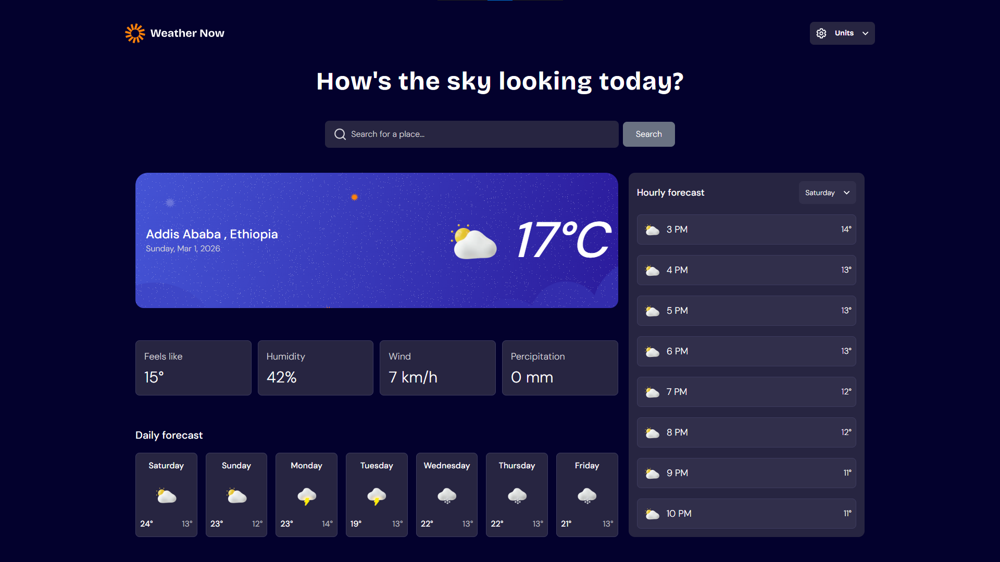

# Frontend Mentor - Weather app solution

This is a solution to the [Weather app challenge on Frontend Mentor](https://www.frontendmentor.io/challenges/weather-app-K1FhddVm49). Frontend Mentor challenges help you improve your coding skills by building realistic projects.

## Table of contents

- [Overview](#overview)
  - [The challenge](#the-challenge)
  - [Screenshot](#screenshot)
  - [Links](#links)
- [My process](#my-process)
  - [Built with](#built-with)
  - [What I learned](#what-i-learned)
  - [Continued development](#continued-development)
  - [Useful resources](#useful-resources)
  - [AI Collaboration](#ai-collaboration)
- [Author](#author)

## Overview

### The challenge

Users should be able to:

- Search for weather information by entering a location in the search bar
- View current weather conditions including temperature, weather icon, and location details
- See additional weather metrics like "feels like" temperature, humidity percentage, wind speed, and precipitation amounts
- Browse a 7-day weather forecast with daily high/low temperatures and weather icons
- View an hourly forecast showing temperature changes throughout the day
- Switch between different days of the week using the day selector in the hourly forecast section
- Toggle between Imperial and Metric measurement units via the units dropdown
- Switch between specific temperature units (Celsius and Fahrenheit) and measurement units for wind speed (km/h and mph) and precipitation (millimeters) via the units dropdown
- View the optimal layout for the interface depending on their device's screen size
- See hover and focus states for all interactive elements on the page

### Screenshot

### Links

- Solution URL: [Add solution URL here](https://your-solution-url.com)
- Live Site URL: [Add live site URL here](https://your-live-site-url.com)

## My process

### Built with

- [React](https://reactjs.org/) - JS library
- [TailwindCSS](https://tailwindcss.com) - UI library
- [Vite](https://vite.dev) - Build tool for the web
- [Zustand](https://zustand-demo.pmnd.rs/) - state management solution
- [Open-Meteo](https://open-meteo.com/en/docs) - API for Weather data

### What I learned

- Integrate complex API into web apps
- Build responsive apps for all kinds of screens
- Componetize way of implementing different sections of an application
- State managment throught the app

### Continued development

Love working on this project as it challenged me to think more and do more than just building interfaces and will be looking out for such kind of projects

### Useful resources

- [TailwindCSS](https://tailwindcss.com) Tailwind documentation
- [Zustand](https://zustand-demo.pmnd.rs/) - Zustand examples on how to use their library. I'd recommend it for state management for react apps as it is simple yet can handle complex logic
- [Open-Meteo](https://open-meteo.com/en/docs) docs and their npm package [openmeteo](https://www.npmjs.com/package/openmeteo) made it easier to understand how their api worked and how to use them
- [ChatGPT](https://chatgpt.com) helped be debug and implement some of the features in the app

### AI Collaboration

I mostly used [ChatGPT](https://chatgpt.com) implement some of the features like debounce search filter. Also helped in debugging some issues regarding openmeteo API

## Author

- Website - [Mikiyas Kebede](https://my-portfolio-pvae.onrender.com/)
- Frontend Mentor - [@Miki0035](https://www.frontendmentor.io/profile/Miki0035)
- Twitter - [@MikiMknewkebede](https://x.com/MikiMknewkebede)
